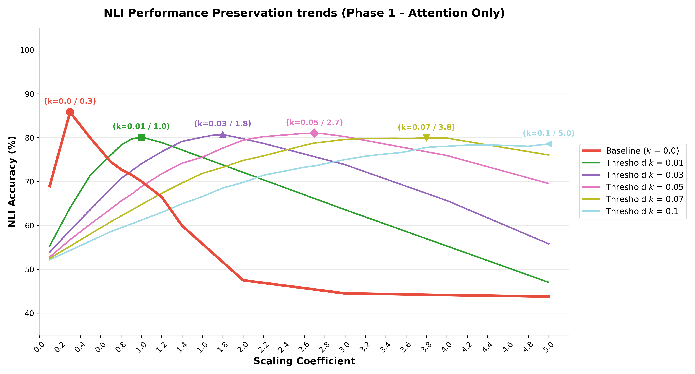
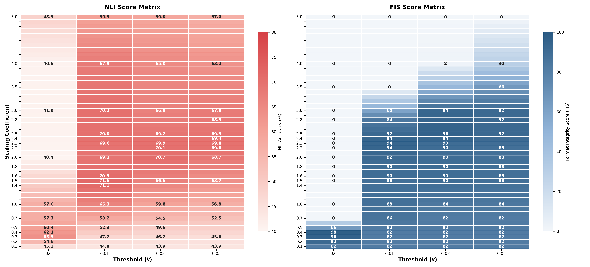

# Core Space 내 TATR 기법을 활용한 Multi-task learning Agent의 text format 붕괴 방어 연구

[](https://huggingface.co/meta-llama/Meta-Llama-3-8B-Instruct)
[](https://opensource.org/licenses/Apache-2.0)

## 📌 Background & Motivation
거대 언어 모델(LLM) 기반 에이전트는 높은 추론 능력뿐만 아니라, 도구 사용 결과를 JSON이나 대화 템플릿 등 특정 형식으로 출력하는 **'지시 이행(Instruction Following)'** 능력이 필수적입니다. 
하지만 task 지식을 병합할 때 발생하는 **가중치 간섭(Catastrophic Interference)**은 답변 구조가 파괴되는 **format 붕괴 현상**을 유발하며, 이는 실제 서비스 환경에서 치명적인 장애로 이어집니다.

본 연구는 연산 효율이 높은 **Core Space Merging** 기법에 파라미터 민감도 기반의 컷오프 기법인 **TATR (Task Arithmetic with Trust Region)**을 결합하여, Multi-task 환경에서 에이전트의 text format 붕괴를 효과적으로 방어하는 새로운 메커니즘을 제안합니다.

## 🛠️ Experimental Setup (실험 환경)
* **Base Model:** `meta-llama/Meta-Llama-3-8B-Instruct`
* **Target Datasets (6 NLI Tasks):** SNLI, MNLI, SICK, QNLI, RTE, SciTail
* **Fine-tuning Method:** LoRA (Rank 24)
* **Evaluation Benchmarks:**
  1. **NLI Accuracy:** 6개의 자연어 추론 task를 통해 모델의 지식 흡수력 및 다중 분류/논리적 추론 능력을 정량 평가
  2. **Format Integrity Score (FIS):** 에이전트 환경의 3-Step Parsing(Syntax, Key, Value Type)을 기반으로 순수 포맷 유지력 평가

## 🚀 Main Contributions (실험 방법 및 결과)

### Phase 1: Attention-level Cross-Model Injection
* **실험 목적:** Task 지식을 Instruct 모델로 이식하는 과정(Attention Layer)에서 발생하는 format 붕괴 양상을 분석하고 본 방법론의 방어력을 1차 검증
* **접근법:** text 생성 및 format 관찰에 용이한 Instruct 모델을 Backbone으로 삼고, Baseline의 Base 모델에서 튜닝된 LoRA Task Vector를 주입하여 평가 환경 구축
* **결과:** TATR 적용 시, 스케일링 계수가 증가함에 따라 베이스라인 성능이 무너지는 현상을 방어하고 강건한 보존 구역(Preservation Range)을 확보했습니다.



### Phase 2: MLP-level Deep Injection
* **실험 목적:** 방대한 MLP 계층까지 주입 범위를 확장하여, 극한의 파라미터 충돌 상황에서도 format을 방어할 수 있는지 최종 검증
* **접근법:** MLP 확장에 따른 가중치 간섭에만 집중하기 위해, Base가 아닌 Instruct 모델을 Backbone으로 삼아 MLP 계층까지 LoRA를 재학습하여 통제 변인 최소화
* **결과:** NLI 지식 추론 능력과 FIS 포맷 유지력을 모두 방어하는 최적의 임계값 타협점(Sweet-spot)을 도출하는 데 성공했습니다.




## 📁 Repository Structure
본 레포지토리는 연구에 사용된 핵심 스크립트와 평가 코드를 포함하고 있습니다.

```text
core-space-merging/
├── configs/                     # 모델 훈련 및 병합을 위한 하이퍼파라미터 설정 파일
├── dataset/                     # 파인튜닝 및 평가에 사용된 데이터셋
├── eval_scripts/                # 병합된 모델의 NLI 정확도 및 FIS 포맷 유지력 평가 스크립트
├── training_scripts/            # Task별 LoRA 어댑터 파인튜닝 스크립트 (모듈화)
├── models/                      # 모델 아키텍처 정의 및 로드 유틸리티
├── fig/                         # README 및 결과 시각화용 이미지 폴더
├── task_merger.py               # Core Space 내 TATR 기법이 결합된 핵심 가중치 병합 모듈
├── merging_functions.py         # 다양한 모델 병합 알고리즘 연산 함수 모음
├── masking_ops.py               # 파라미터 민감도 기반 마스킹 및 컷오프(TATR) 연산 스크립트
├── ft_handlers.py               # 파인튜닝 프로세스 핸들러
├── accuracies.py                # 성능 평가 지표 및 정확도 산출 모듈
├── utils.py                     # 데이터셋 전처리 및 공통 유틸리티 함수
├── heads.pt                     # 추출된 Attention 계층 가중치 파일
├── heads_mlp.pt                 # 추출된 MLP 계층 가중치 파일
├── example_eval.sh              # 벤치마크 평가 실행용 쉘 스크립트
└── environment.yml              # 모델 실행을 위한 가상환경 세팅 파일
```

## 🙏 Acknowledgements

본 프로젝트는 아래 논문 및 공식 저장소의 코드를 기반으로(Fork) 진행되었으며, 2026-1 아주대학교 Softcon 자기주도연구 목적에 맞게 확장 및 수정되었습니다. 훌륭한 베이스라인 코드를 오픈소스로 공개해 주신 원작자분들께 깊은 감사를 드립니다.

* **Paper:** [Accurate and Efficient Low-Rank Model Merging in Core Space (NeurIPS 2025)](https://arxiv.org/abs/2509.17786)
* **Original Repository:** [apanariello4/core-space-merging](https://github.com/apanariello4/core-space-merging)

또한, 원본 저장소의 저자들이 영감을 받고 기반으로 삼았다고 밝힌 [KnOTS](https://github.com/gstoica27/KnOTS) 프로젝트의 저자분들께도 감사의 뜻을 전합니다. 본 프로젝트는 원본과 동일하게 Apache License 2.0을 준수합니다.
